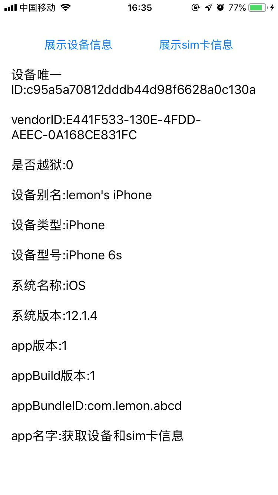
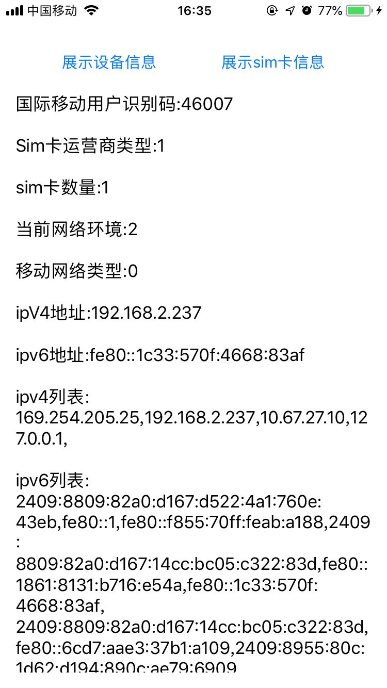

# LMDeviceInfoCollector

[](https://travis-ci.org/545390087@qq.com/LMDeviceInfoCollector)
[](https://cocoapods.org/pods/LMDeviceInfoCollector)
[](https://cocoapods.org/pods/LMDeviceInfoCollector)
[](https://cocoapods.org/pods/LMDeviceInfoCollector)

## ScreenShot 




## Usage

```
#import <LMDeviceInfoCollector/LMDeviceInfo.h>
```

Use the `+ (instancetype)shareDeviceInfo;` method to create  instance , and visit the property.


## Example

To run the example project, clone the repo, and run `pod install` from the Example directory first.

## Requirements

## Installation

LMDeviceInfoCollector is available through [CocoaPods](https://cocoapods.org). To install
it, simply add the following line to your Podfile:

```ruby
pod 'LMDeviceInfoCollector'
```

## Author

545390087@qq.com, codebulucck@163.com

## License

LMDeviceInfoCollector is available under the MIT license. See the LICENSE file for more info.
